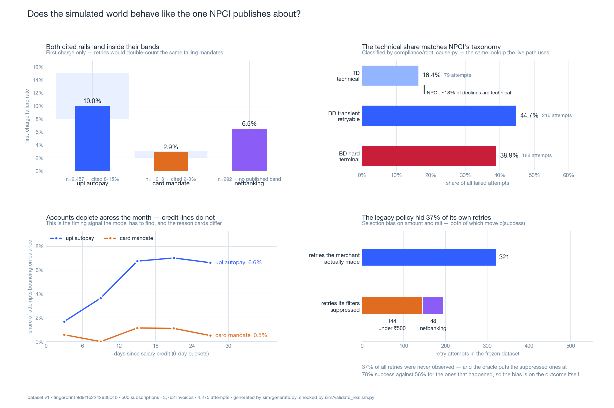

# Data

The dataset is **frozen**: `Winback dataset v1 (9d9f1e2242930c4b)`. The fingerprint is
a content hash over every generated row, pinned in `sim/tests/test_generate.py`. Change
a world constant and that test fails — which forces the realism gate to be re-run and
this document updated in the same commit, instead of the headline numbers quietly
drifting away from the prose describing them.

| Quantity | Value |
|---|---|
| customers | 500 |
| subscriptions | 500 — train 300 / calibrate 100 / test 100 |
| invoices | 3,762 |
| payment attempts | 4,275 — 4,083 observed, 192 censored (4.5%) |
| first-charge failure rate | 7.79% over 3,762 debits |
| invoice outcomes | 3,469 paid · 171 recovered · 98 written off · 24 at risk |
| revenue at risk | ₹61,102 |
| as of | 2026-08-24 IST |

Regenerate and load with `.venv/bin/python -m sim.generate --load`; verify with
`.venv/bin/python -m sim.validate_realism`.

## 01 — Schema

Eight tables and two views in `db/01_schema.sql`, split along one line: **facts are
immutable, state is not.**

| Table | Kind | Notes |
|---|---|---|
| `customers` | state | `customer_hash` = `sha256(customer_id)[:12]`, the only identifier permitted into `audit_log` |
| `subscriptions` | state | `cohort ∈ {train, calibrate, test}` frozen at generation, before any model exists |
| `invoices` | state | One row per billing cycle. Both revenue-at-risk and the 1+3 budget are scoped to it. |
| `payment_attempts` | **immutable** | Observational history (`run_id IS NULL`) *and* evaluation-arm attempts, one table |
| `decisions` | **immutable** | Includes `candidate_set` — every scored option, not just the winner |
| `audit_log` | **immutable** | Append-only, `execution_mode` per row |
| `eval_runs` / `eval_arm_results` | regenerated | So `EVALUATION.md` is generated from the database, never hand-typed |
| `exception_worklist` / `recovery_funnel` | views | What the dashboard reads |

Three conventions that are load-bearing:

- **Money is always paise, always `BIGINT`.** No float touches a rupee value anywhere in
  this system.
- **IST wall-clock is a generated column**, not application arithmetic. Every NPCI rule
  here is expressed in IST wall-clock, and re-deriving it at two call sites is how two
  call sites drift apart. `attempted_at_ist`, `charge_at_ist` and `ts_ist` are computed
  by Postgres from the `TIMESTAMPTZ`.
- **The 1+3 cap is a `CHECK` constraint**, not only a Python rule:
  `attempt_number CHECK (BETWEEN 1 AND 4)`. A policy bug that proposes a fifth attempt
  fails to persist even if every layer above it were wrong.

Two invariants pair columns that must agree:

```sql
CHECK ((run_id IS NULL) = (arm IS NULL))          -- history xor evaluation, never half
CHECK (observed = (censoring_reason IS NULL))     -- no unexplained hole in the training data
```

## 02 — The simulator is a counterfactual oracle

`sim/world.py` implements a **structural** hazard model — deliberately a different
functional form from the gradient-boosted tree that will try to learn it, so the
evaluation is not a model checking its own homework:

```
p_success(attempt) = clip(
      base(method, bank)                # UPI Autopay 8-15% failure, card mandate 2-3%
    × f_rootcause(TD | BD_transient | BD_hard)
    × g_attempt(attempt_number)         # TD decays slowly; BD_hard ≈ 0
    × h_window(is_non_peak)             # congestion — applies to TD only
    × balance_process(customer, date)   # salary cycle: balance replenishes days 1-7
    × k_recency(days_since_last_success),  0, 1)
```

`balance_process` is the realism that matters. `insufficient_funds` retries succeed far
more often just after payday, which is the actual mechanism behind India's UPI-Autopay
failures — and it gives the model a **genuine timing signal to discover** rather than a
coefficient to memorise.

**Determinism.** Every outcome is drawn from a seed derived from
`sha256(channel, subject_id, invoice_id, attempt_number, action, slot)`, stored in
`payment_attempts.oracle_seed`. The key contains **no `run_id` and no `arm`** — that
omission is the whole design. The coin flip for any `(attempt, action, slot)` is fixed
regardless of which policy asks for it, which buys two things:

- a full counterfactual over actions that were never taken;
- **paired** comparison across policy arms — the same coin flips, so the difference
  between arms is policy and nothing else, and a paired bootstrap is legitimate.

## 03 — The training data is censored, on purpose

`sim/legacy_policy.py` generates the *historical* dataset the model trains on, the way a
crude pre-2025 merchant would have:

> retry at fixed T+1 / T+2 / T+3 at 09:00 IST — **but only if `amount > ₹500` and
> `method != netbanking`**; above ₹2,000 take the "chase it hard" branch instead, at
> 11:30 IST.

Every clause is a decision someone plausibly made, and each has a consequence:

| Clause | Why it was set | What it does to the data |
|---|---|---|
| `amount > ₹500` | "don't waste a gateway call on small invoices" | **144 censored retries** — bias on a variable correlated with the outcome |
| `method != netbanking` | the retry job was never extended to a late-onboarded rail | **48 censored retries** — not a policy at all, just a gap nobody closed |
| 11:30 IST urgent branch | legal when it was written; NPCI moved in Aug 2025 | countable peak-window **violations** in arms B and C |
| 09:00 IST standard branch | so a human could watch the run | legal under OC-215-A by accident, not by design |

Censored retries are materialised with `observed = FALSE` and a `censoring_reason`, and
— the load-bearing part — **their outcomes are discarded when deciding the invoice's
status.** In real history those retries never happened, so a shadow retry the oracle says
would have captured must not turn an unpaid invoice into a recovered one. Letting it
would hand the model a label it could never have seen and inflate every arm at once.

**The censored region is genuinely different, and measurably so.** Mean oracle
`p(success)` is **78.4% on the retries the legacy filters suppressed** versus **56.4% on
the retries it actually made**. The suppressed region is the *easier* one — small
invoices and a rail with lower balance exposure — which is exactly the bias a value
floor produces. That gap is what makes the Day-4 observed-vs-censored calibration split
a real test rather than a formality.

## 04 — Splits

Held out **by `customer_id` and by time**: train 300 earliest, calibrate 100, test 100
latest, ordered by mandate start (train ≤ 2026-02-12, test ≥ 2026-04-22). No customer
straddles two splits and no future information leaks backwards. The test set is frozen
before any tuning and scored **once**.

## 05 — Realism gate

`sim/validate_realism.py` is a gate, not a report: 16 checks, each carrying its source,
its `n`, and its band. It exits non-zero if any graded check falls outside its band.
Current state — **PASS = 13, REPORT = 3, FAIL = 0**.



Three checks are deliberately **ungraded** and printed as `[REPORT]`: the netbanking
failure rate, the hard/transient split within business declines, and the censoring
breakdown. There is no published figure worth quoting for any of them. Grading them
would mean inventing a band and then tuning the world until it hit — which is how a
simulator stops being evidence of anything.

| Check | Measured | Band | Source |
|---|---|---|---|
| UPI Autopay failure rate | **9.97%** (n=2,457) | 8-15% | industry reporting on UPI Autopay mandates |
| Card mandate failure rate | **2.86%** (n=1,013) | 2-3% | card e-mandate rates run far below UPI |
| Netbanking failure rate | 6.51% (n=292) | *ungraded* | no citable published figure |
| Technical declines / all declines | **16.36%** (n=483) | 14-22% | NPCI TD/BD taxonomy, ~18% technical |
| Business declines / all declines | **83.64%** (n=483) | 78-86% | complement of the above |
| Hard / business declines | 46.53% (n=404) | *ungraded* | finer than NPCI's own split |
| UPI balance failures across salary cycle | **5.19% → 11.04% (2.1×)** | ≥ 2.0× | mechanism, must be learnable |
| Cards feel the cycle less than UPI | **card 0.6× vs UPI 2.1×** | card < UPI | a credit line absorbs what an empty account cannot |
| Technical declines in peak hours | **1.69% → 5.35%** | peak > off-peak | OC-215-A rations peak because peak is congested |
| Recoveries after a hard decline | **0 of 139** | exactly 0 | revoked / expired / closed are terminal |
| Observed vs censored `p(success)` | **56.4% vs 78.4%** | differ ≥ 3pp | the filters select on outcome-correlated variables |
| Population straddles ₹500 / ₹2,000 / ₹15,000 | 124/376 · 311/189 · 464/36 | ≥ 20 each side | every threshold must be exercised |
| Cohorts ordered in time | train ≤ 2026-02-12, test ≥ 2026-04-22 | strict order | no leakage backwards |

## 06 — The one tuning pass, in full

The first generated world missed two bands. Rather than fit constants until the gate
went green, both levers were required to be **mechanistically justifiable independently
of the number they were aimed at**. If a constant can only be defended by its target, it
is a fitted parameter wearing a mechanism's clothes, and the gate it passes proves
nothing.

**`balance_exposure`** — how much of an empty account each rail actually feels:

```python
("upi_autopay", 1.00)    # debits a savings account directly, right now
("netbanking",  0.90)    # same account, but batch-presented and retried within the day
("card_mandate", 0.10)   # a credit line absorbs the debit; the balance is not the binding constraint
```

**`authorization_base`** — per-cycle authorization *surfaces*, each of which can fail:

```python
("upi_autopay", 0.013)   # resolve a VPA + reach a PSP + look up the mandate at NPCI = 3
("netbanking",  0.009)   # reach the bank + look up the mandate = 2
("card_mandate", 0.007)  # AFA happened once at registration; one network authorization = 1
```

The ordering 3 > 2 > 1 is a count of things that exist, not a ranking chosen to produce
`0.013 > 0.009 > 0.007`. The constants were then read off that count, and the resulting
failure rates landed inside the cited bands — in that order, not the reverse.

Cards being flatter across the salary cycle is asserted by the gate, and a card hazard
pinned at zero would satisfy that assertion trivially. So a separate test
(`test_a_card_still_feels_the_cycle_in_the_same_direction`) asserts cards still track the
cycle in the same direction — flatter, not flat.

## 07 — What the worklist contains

The 24 at-risk invoices were not curated; they are what the legacy policy left behind.
They happen to contain one of every case the compliance layer exists to handle, which is
why the Day-6 demo runs on real rows rather than a fixture:

| Case | Example | What must happen |
|---|---|---|
| Above the RBI AFA ceiling | `inv_0090_08`, ₹18,392 netbanking | escalate to a human, never auto-debit |
| Attempt budget exhausted | `inv_0488_03`, 4 of 4 used | the 5th attempt is **blocked** — the demo's proof shot |
| Consent withdrawn | `inv_0132_09` | every nudge channel blocked regardless of model score |
| Hard decline | `inv_0190_13`, `BD_hard` | re-register the mandate; retrying is known-futile |
| Budget remaining, transient | 16 invoices with 3 attempts left | the actual recovery opportunity |

Distribution of remaining budget: 16 invoices with 3 attempts left, 2 with 2, 4 with 1,
and 2 with none.

## 08 — Scale and population

| Rail | Subscriptions | Min | Mean | Max |
|---|---|---|---|---|
| UPI Autopay | 334 | ₹107 | ₹3,210 | ₹53,121 |
| Card mandate | 120 | ₹105 | ₹4,443 | ₹27,252 |
| Netbanking | 46 | ₹108 | ₹3,756 | ₹26,006 |

Attempts by number: 3,762 first charges, then 277 / 130 / 106 retries. The taper is the
dunning funnel — most invoices are settled or abandoned before the budget runs out.

Amounts are spread so that **every threshold the compliance layer knows about is
exercised on both sides**: the ₹500 legacy value floor (124 below / 376 above), the
₹2,000 urgent branch (311 / 189), and the ₹15,000 RBI AFA ceiling (464 / 36). A rule
whose boundary no row ever crosses is untested in practice however many unit tests it
has.

## 09 — Regenerating

```bash
.venv/bin/python -m sim.generate           # build in memory, print the summary
.venv/bin/python -m sim.generate --load    # calls winback_reset_world(), then loads
.venv/bin/python -m sim.validate_realism   # gate + regenerate docs/assets/realism.png
```

Regeneration is the one operation that legitimately removes immutable rows — it is
rebuilding history, not editing it. It routes through the `winback_reset_world()`
`SECURITY DEFINER` function rather than through a `DELETE` grant, so the escape hatch is
a single named, greppable, log-emitting call instead of an ambient permission.

Everything else is genuinely append-only, and this was verified against the loaded
dataset rather than assumed:

| Attempt | Role | Result |
|---|---|---|
| `UPDATE`/`DELETE` on `audit_log` | `winback_agent` | `permission denied` — the grant layer |
| `UPDATE`/`DELETE` on `audit_log` | `winback_owner` | `append_only_violation` — the trigger, which the table's own owner cannot bypass |
| `TRUNCATE audit_log` | `winback_owner` | `append_only_violation` — caught by a separate statement-level trigger |
| `UPDATE` on `payment_attempts` | `winback_agent` | `permission denied` |

The owner case is the one that matters. A trigger the owner can bypass is a convention;
a trigger that refuses the owner is a control.
