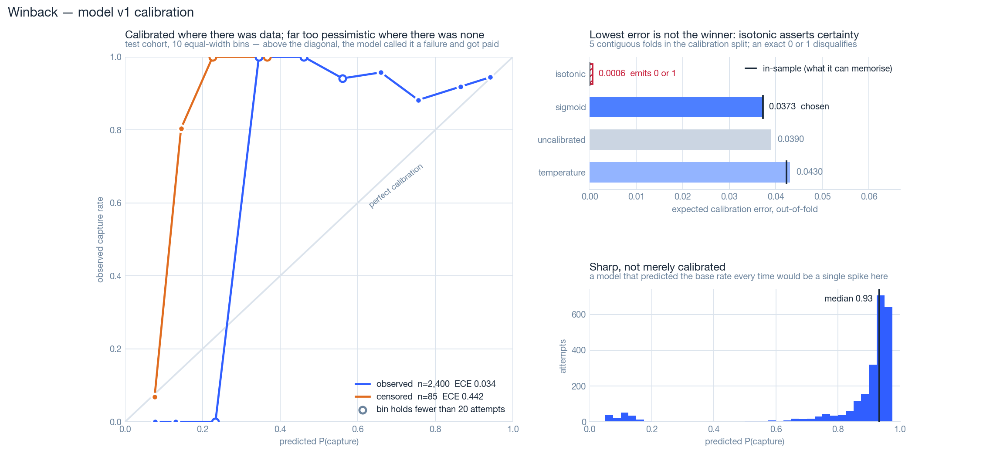

# Evaluation

> **Status: the model is measured (§05–§07); the four-arm comparison is not.** Sections
> 05 to 07 are frozen results from `ml/artifacts/metrics_v1.json`, written by
> `python -m ml` and reproduced by `ml/tests/test_calibrate.py` on every run. The
> arm-by-arm sections are written by `python -m eval.report` directly from `eval_runs` /
> `eval_arm_results` on Day 5 — never hand-typed. Numbers that a human can retype are
> numbers a human can round. The design below was fixed before the results existed, so
> that they could not be chosen after seeing them.

## 01 — The metric

**Rupees recovered per legal attempt consumed**, reported beside a
compliance-violations count. Not rupees recovered.

A policy that recovers more money by taking a fifth attempt has not beaten anything —
it has broken NPCI OC-215-A, and no merchant can ship it. Making legality part of the
denominator rather than a footnote is what makes the comparison honest, and it is why
the naive baseline loses on grounds that were fixed before the experiment ran.

## 02 — The four arms

| Arm | Policy | Role |
|---|---|---|
| A | Never retry, always escalate | Over-conservative floor |
| B | Retry everything to the cap, any hour | Naive baseline — **and illegal** |
| C | Legacy policy (fixed T+1/2/3 at 09:00, amount- and method-filtered) | What the merchant does today |
| D | **Winback** — calibrated model + cost policy + guardrail | The submission |

All four are scored on the **same** held-out invoices with the **same** oracle seeds,
so a difference between arms is a difference in policy and not in luck. Confidence
intervals come from a paired bootstrap over subscriptions.

## 03 — What gets reported, per arm

Rupees recovered · attempts consumed · **legal** attempts consumed ·
**rupees per legal attempt** · nudges sent · escalations · **compliance violations** ·
invoices written off · paired bootstrap CI.

Plus, for the model itself: ECE (10-bin) · Brier · PR-AUC · minority-class
precision/recall · reliability diagram · the confusion matrix **priced in rupees**
(a false positive costs one burned legal attempt plus messaging; a false negative
costs the invoice times margin). Never plain accuracy — on an 8–15% failure base rate
accuracy is a number that rewards predicting nothing.

## 04 — Calibration on the censored slice

Reported separately for the slice the legacy policy observed and the slice it never
retried (low-value, netbanking). The gap between them is the honest measure of how far
the model can be trusted outside its training distribution, and it is reported whether
or not it flatters the result. It did not. See §06.

---

## 05 — Model v1, frozen

`python -m ml` trains, calibrates, evaluates and writes every artifact in one command.
The test split is touched **once**, at the end of that file, after the calibrator has
already been chosen on the calibration split.

| | |
|---|---|
| Model | XGBoost binary classifier, `max_depth=5`, `learning_rate=0.05`, `min_child_weight=10`, `random_state=20260828` |
| Early stopping | iteration **339** of 600, on a time-ordered inner split (22,005 fit / 3,884 inner validation) |
| Rows | train 25,889 · calibrate 4,791 · test 2,400 · censored calibrate 118 · censored test 85 |
| Base rate | 87.0% captured on test — which is why accuracy appears nowhere below |

**Gain-ranked features.** The three that carry the model are the ones a dunning
operator would name: what went wrong last time, how many attempts have already been
spent, and which rail the mandate sits on.

| Feature | Gain |
|---|---|
| `prior_root_cause_bd_hard` | 43.4% |
| `attempt_number` | 19.3% |
| `method_upi_autopay` | 8.2% |
| `action_is_retry` | 4.9% |
| `paid_count` | 4.1% |
| `prior_root_cause_bd_transient` | 2.6% |
| `bank_method_failure_rate` | 2.1% |
| `cycle_number` | 2.0% |
| `mandate_age_days` | 1.9% |
| everything else | < 1.5% each |

`salary_day` is not in the table because it is not in the model. The simulator uses it
to drive the balance hazard; a merchant cannot see it, so the feature builder never
reads it, and `ml/tests/test_features.py` shuffles every customer's payday and asserts
the feature row comes back byte-identical. The model has to *discover* the payday
effect through `day_of_month`, or not at all.

### The calibrator, chosen out-of-fold

Five contiguous time-ordered folds inside the calibration split. Each candidate is
scored on rows it did not see; the winner is then refit on the whole split.

| Calibrator | ECE (out-of-fold) | ECE (in-sample) | Rows at exactly 0 or 1 | |
|---|---|---|---|---|
| uncalibrated | 0.0390 | — | — | the baseline to beat |
| **sigmoid** | **0.0373** | 0.0372 | 0 | **chosen** |
| temperature | 0.0430 | 0.0423 | 0 | |
| isotonic | 0.0006 | 0.0000 | 913 | **disqualified** |

Isotonic posts an ECE sixty times lower than the winner and loses anyway. It is a step
function bounded by its outermost knots, so every score outside the range it was fitted
on maps to exactly 0.0 or exactly 1.0 — which it does to 242 calibration rows at zero,
560 at one, and **111 of the 118 censored calibration rows**, every one of them at
zero. A probability of exactly zero is not a low probability; it is a claim no evidence
can revise. The Day-5 policy ranks candidate actions by expected rupees, and an
expected value of exactly zero can never be the argmax — so a calibrator that zeroes
the censored region would make Winback decline to retry precisely the invoices the
legacy policy declined to retry, reimplementing the selection bias this project exists
to remove, one layer further down and silently. Admissibility is therefore a gate, not
a tiebreak, and it is checked on the calibration cohort's censored slice so that
disqualifying isotonic costs nothing that was being held back.

The gap between the two ECE columns is why selection runs out-of-fold at all. An
earlier version of `ml/calibrate.py` scored each calibrator on the rows it was fitted
on, and isotonic won with an ECE of exactly 0.0000 — because a free monotone step
function fitted on 4,791 rows can reproduce those 4,791 rows. Three methods of very
different capacity cannot be compared in-sample; the comparison ranks them by how much
they can memorise. Both columns are printed so a reader can see the distance.

### Test cohort, scored once

| Slice | n | ECE | MCE | Brier | PR-AUC (failure) | ROC-AUC |
|---|---|---|---|---|---|---|
| test, uncalibrated | 2,400 | 0.0775 | 0.6477 | 0.0694 | 0.6834 | 0.8197 |
| **test, observed** | 2,400 | **0.0342** | 0.6549 | 0.0602 | 0.6834 | 0.8197 |
| test, censored | 85 | **0.4420** | 0.7740 | 0.4103 | 0.8911 | 0.8643 |

Calibration halves the ECE and moves nothing else: sigmoid is monotone, so it cannot
reorder predictions, and PR-AUC and ROC-AUC are rank statistics. That is the expected
result and it is reported rather than dressed up.

### The confusion matrix, priced in rupees

At the **per-invoice break-even threshold** implied by the cost matrix — attempt when
`p · amount · margin > (1 − p) · (attempt cost + burned attempt)`, which solves to
`p > c / (c + amount · margin)` — with `attempt_cost = ₹3`, `burned attempt = ₹12`,
`margin = 0.25`:

| | |
|---|---|
| Margin recovered | ₹19,752 |
| Wasted attempt cost | ₹39 |
| Margin forgone | ₹0 |
| Net | ₹19,713 |
| Attempts declined on cost alone | **52 of 2,400** |

Those thresholds land between 0.0010 and 0.3704, median **0.0425**. That is the
finding, and it is not a flattering one for threshold-based framings of this problem:
**the money almost never says no.** A retry costs ₹15 all-in and an invoice averages
several hundred, so expected value alone would attempt nearly everything. Money is not
the scarce resource here — the four legal attempts are. This is precisely why the
Day-5 policy maximises expected rupees *subject to the NPCI budget* rather than
thresholding on probability, and why the headline metric is rupees per legal attempt.

## 06 — What the censored slice actually showed

The legacy policy never retried an invoice under ₹500 or on netbanking, so the model
has no training evidence in that region — but the oracle knows what would have happened
there. Scored against it:

| | Observed slice | Censored slice |
|---|---|---|
| ECE | 0.0342 | **0.4420** |
| Mean signed gap vs the oracle | −0.021 | **−0.452** |
| Mean absolute gap | 0.095 | 0.500 |
| ROC-AUC | 0.8197 | **0.8643** |
| PR-AUC (failure) | 0.6834 | 0.8911 |

**The model is badly miscalibrated off-distribution and still ranks correctly there.**
Every censored prediction falls below 0.40 while 56% of those attempts capture; the
model is not confused about which censored invoices are the good ones, it is uniformly
too pessimistic about all of them. In the 0.1–0.2 bin it predicts 14% and observes 80%.

This is a stronger result than uniform failure would have been, and it is the reason
the policy layer is built the way it is. Miscalibrated-but-ordered means the *absolute*
probability is untrustworthy in the censored region while the *relative* one survives —
so a policy that picks the best of several candidate actions is far less damaged there
than one that thresholds on a number. `ml/tests/test_calibrate.py` asserts all of it:
the gap, its direction, and that ranking holds.

One thing this does **not** show. The censored region's marginal success rate is close
to the observed one (61.8% vs 58.2% pooled; +3.5 / +1.6 / −3.7 points at attempts 2, 3
and 4), and the ₹500 value floor barely moves p(success) at all — +1.0 points measured
on first charges, which no filter touches. The netbanking exclusion moves it more, +3.4
points. So the bias is not in the marginal; it is in the covariates. The censored region
is cheap, netbanking, and early in a mandate's life, and the observed data contains
almost none of that combination. A near-identical marginal success rate alongside a
large calibration gap is not a weaker result than the reverse would have been — it is
the more interesting one, because it is the case a merchant would never catch by
watching their recovery rate.

## 07 — The limitation, stated first

Arm D beats arms B and C **inside a world I wrote**. Three things were done to make
that less circular than it sounds — the simulator uses a deliberately different
functional form from the model, the training data is censored by a biased legacy
policy so the model must generalise past what it observed, and calibration is measured
on both slices — but a simulator is a model, not the world. Naming this before a
panelist does is not modesty; it is the only reading of the evidence that survives
contact with someone who has run a real dunning system.
